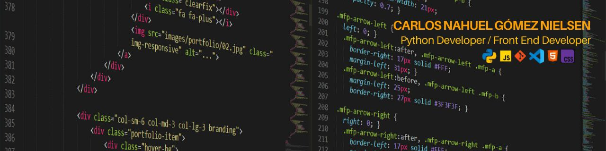

# Bienvenidos a mi portfolio | Welcome to my portfolio 

### Acerca de mí | About me

Mí nombre es Carlos. 
Me encuentro diplomado en Python. 
Me encuentro recibido del Curso de Programador Web Inicial - Front End Developer. 
Soy estudiente de la Tecnicatura Universitaria en Programación. 
Vivo en Buenos Aires, Argentina. 
Actualmente, encuentro abierto a nuevas oportunidades laborales. 

My name is Carlos. 
I have a Python degree. 
I have completed the Introductory Web Programmer – Front End Developer course. 
I am a student in the University Technical Career in Programming. 
I live in Buenos Aires, Argentina. 
I'm currently open to new job opportunities. 

### Lenguajes y herramientas que utilizo | Languages ​​and tools I use

### Análisis de GitHub | GitHub Analytics

[comentario]: <> (se agrego &cache_seconds=1800 para actualizar cada 30 minutos las estadisticas de github)

