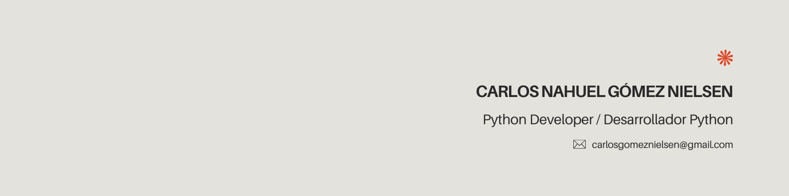

# Bienvenidos a mi portafolio | Welcome to my portfolio

comentario sobre mi. nombre,que tengo, que estudio,que quiero

## Lenguajes que utilizo | Languages ​​I use

## Lenguajes en estudio | Languages ​​in study

## Herramientas que uso | Tools I use

